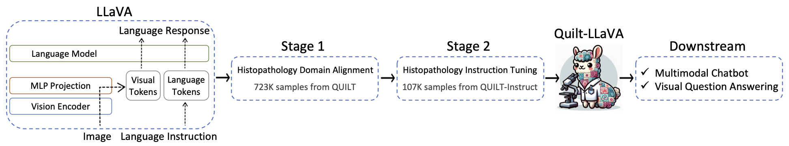
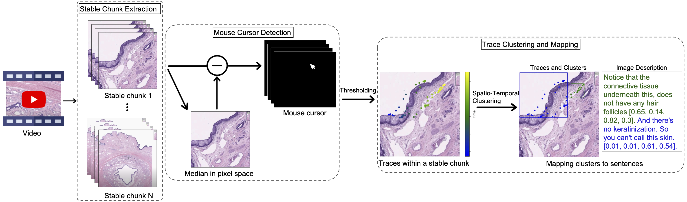

# Quilt-LLaVA: Visual Instruction Tuning by Extracting Localized Narratives from Open-Source Histopathology Videos


We generated spatially grounded visual instruction tuning data from educational YouTube videos to train large language and vision assistant in histopathology that can localize the prominent medical regions and reason towards diagnosis.

[[Paper, Arxiv](https://arxiv.org/abs/2312.04746)] 


[Mehmet Saygin Seyfioglu*](https://mehmetsayginseyfioglu.github.io/), [Wisdom Ikezogwo*](https://wisdomikezogwo.github.io/), [Fatemeh Ghezloo*](https://fghezloo.github.io/), [Ranjay Krishna](https://www.ranjaykrishna.com/index.html), [Linda Shapiro](https://homes.cs.washington.edu/~shapiro/) (*Equal Contribution)


<p align="center">
     <br>
</p>


<p align="center">
     <br>
 
  *Quilt-LLaVA was initialized with the general-domain LLaVA and then continuously trained in a curriculum learning fashion (first biomedical concept alignment then full-blown instruction-tuning). We evaluated LLaVA-Med on standard visual conversation and question answering tasks. We release both stage 1 (Quilt) and stage 2(Quilt-Instruct) training sets as well as our evaluation dataset Quilt-VQA*
</p>


## Release
- Quilt-LLaVA is open-sourced under the X release policy, which does not allow any commercial use. Checkout the [paper](https://arxiv.org/pdf/2312.04746.pdf)
- Alongside Quilt-LLaVA, we also release Quilt-Instruct, our instruction-tuning data generated from educational videos. It is also protected by Y license.
- We also release Quilt-VQA, an evaluation dataset to evaluate generative multi modal histopathology models. 


<p align="center">
     <br>
 
  *We have created a grounded image-text dataset from educational histopathology videos on YouTube. The bottom row displays an illustrative example. First, we detect frames that have a stable background. Then we extract the narrators' mouse cursors. Then, we perform spatio-temporal clustering on the mouse pointer locations to obtain dense visual groundings for the narrators' speech. Using this method, we create grounded image-text dataset, from which we generate Quilt-Instruct to train our visual Language Learning Model, Quilt-LLaVA.*
</p>


## Contents
- [Data Download](#data-download)
- [Data Generation](#Data Generation)
- [Training](#training)
- [Evaluation](#evaluation)


### Data Download
| Instruction-Tuning data | Size |
| --- | ---: |
| [Quilt-Instruct](https://huggingface.co/datasets/wisdomik/QUILT-LLaVA-Instruct-107K) | X MiB |

| Evaluation files | Size |
| --- | ---: |
| [Quilt-VQA](https://huggingface.co/datasets/wisdomik/Quilt_VQA) | 	X MiB |
| [Quilt-VQA Red Circle](https://huggingface.co/datasets/wisdomik/QuiltVQA_RED) | X MiB |

| Raw Mouse Cursor Data | Size |
| --- | ---: |
| [Cursors](some path) | N MiB |

| Image URLS | Size |
| --- | ---: |
| [Images](some path) | N MiB |


### Data Generation
In case if you want to generate the instruction tuning data from scratch, please see quilt-instruct folder.


If you are using Windows, do *NOT* proceed, see instructions [here](https://github.com/haotian-liu/LLaVA/blob/main/docs/Windows.md).

1. Clone this repository and navigate to LLaVA folder
```bash
git clone https://github.com/aldraus/quilt-llava.git
cd quilt-llava
```

2. Install Package
```Shell
conda create -n qllava python=3.10 -y
conda activate qllava
pip install --upgrade pip  # enable PEP 660 support
pip install -e .
```

3. Install additional packages for training cases
```
pip install -e ".[train]"
pip install flash-attn --no-build-isolation
```

## Train


Quilt-LLaVA training consists of two stages: (1) feature alignment stage: use our 723K filtered image-text pairs from [QUILT-1M](https://quilt1m.github.io/) to connect a *frozen pretrained* vision encoder to a *frozen LLM*; (2) visual instruction tuning stage: use 107K GPT-generated multimodal instruction-following data from [QUILT-Instruct](https://huggingface.co/datasets/wisdomik/QUILT-LLaVA-Instruct-107K) to teach the model to follow multimodal instructions.

Quilt-LLaVA is trained on 4 A100 GPUs with 80GB memory. To train on fewer GPUs, you can reduce the `per_device_train_batch_size` and increase the `gradient_accumulation_steps` accordingly. Always keep the global batch size the same: `per_device_train_batch_size` x `gradient_accumulation_steps` x `num_gpus`.


### Hyperparameters
We use a similar set of hyperparameters as Vicuna in finetuning.  Both hyperparameters used in pretraining and finetuning are provided below.

1. Pretraining

| Hyperparameter | Global Batch Size | Learning rate | Epochs | Max length | Weight decay |
| --- | ---: | ---: | ---: | ---: | ---: |
| Quilt-LLaVA-v1.5-7B | 256 | 1e-3 | 1 | 2048 | 0 |

2. Finetuning

| Hyperparameter | Global Batch Size | Learning rate | Epochs | Max length | Weight decay |
| --- | ---: | ---: | ---: | ---: | ---: |
| Quilt-LLaVA-v1.5-7B | 128 | 2e-5 | 1 | 2048 | 0 |

### Download Vicuna checkpoints (automatically)

Our base model Vicuna v1.5, which is an instruction-tuned chatbot, will be downloaded automatically when you run our provided training scripts. No action is needed.

### Pretrain (feature alignment)

Please download the 723K subset/filtered image-text pairs from [QUILT-1M](https://quilt1m.github.io/) dataset with reformatted to QA styling we use in the paper [here](https://huggingface.co/datasets/wisdomik/Quilt-LLaVA-Pretrain).

Pretrain takes around 10 hours for LLaVA-v1.5-7B on 4x A100 (80G).

Training script with DeepSpeed ZeRO-2: [`pretrain.sh`](https://github.com/aldraus/quilt-llava/blob/main/scripts/v1_5/pretrain.sh).

- `--mm_projector_type mlp2x_gelu`: the two-layer MLP vision-language connector.
- `--vision_tower wisdomik/QuiltNet-B-32`: CLIP ViT-B/32 224px.

### Visual Instruction Tuning

1. Prepare data

Please download the annotation of our instruction tuning data [quilt_instruct_107k.json](https://huggingface.co/datasets/wisdomik/QUILT-LLaVA-Instruct-107K/blob/main/quilt_instruct_107k.json), and download the images from Quilt-1M dataset:
- (Rescaled) On [Zenodo](https://zenodo.org/record/8239942) you can access the dataset with all images resized to 512x512 px (36 Gb)
- (Full) To access the dataset with full-sized images via Google Drive, please request time-limited access through this form [Google](https://forms.gle/TKohQ7zLwYfFn8qRA) (110 Gb)

After downloading all of them, organize the data as follows in `./playground/data`,

```
├── Quilt-LLaVA-Pretrain
│   └── quilt_1m/
            └── xxxxxxx.jpg
                ...
            └── yyyyyyy.jpg
    ├── quilt_pretrain.json
```

2. Start training!

You may download our pretrained projectors in [Quilt-Llava-v1.5-7b](https://huggingface.co/wisdomik/Quilt-Llava-v1.5-7b/blob/main/mm_projector.bin). It is not recommended to use legacy projectors, as they may be trained with a different version of the codebase, and if any option is off, the model will not function/train as we expected.

Visual instruction tuning takes around 15 hours for LLaVA-v1.5-7B on 4x A100 (80G).

Training script with DeepSpeed ZeRO-3: [`finetune.sh`](https://github.com/aldraus/quilt-llava/blob/main/scripts/v1_5/finetune.sh).

If you are do not have enough GPU memory:

- Use LoRA: [`finetune_lora.sh`](https://github.com/aldraus/quilt-llava/blob/main/scripts/v1_5/finetune_lora.sh). Make sure `per_device_train_batch_size*gradient_accumulation_steps` is the same as the provided script for best reproducibility.
- Replace `zero3.json` with `zero3_offload.json` which offloads some parameters to CPU RAM. This slows down the training speed.

If you are interested in finetuning LLaVA model to your own task/data, please check out [`Finetune_Custom_Data.md`](https://github.com/haotian-liu/LLaVA/blob/main/docs/Finetune_Custom_Data.md)。

New options to note:

- `--mm_projector_type mlp2x_gelu`: the two-layer MLP vision-language connector.
- `--vision_tower openai/clip-vit-large-patch14-336`: CLIP ViT-L/14 336px.
- `--image_aspect_ratio pad`: this pads the non-square images to square, instead of cropping them; it slightly reduces hallucination.
- `--group_by_modality_length False`: this should only be changed to True when your instruction tuning dataset contains both language data and multimodal (e.g. Quilt-LLaVA-Instruct). It makes the training sampler only sample a single modality (either image or language) during training, which we observe to speed up training by ~25%, and does not affect the final outcome.

## Evaluation
We evaluate models on a diverse set of 4 benchmarks. To ensure the reproducibility, we evaluate the models with greedy decoding. We do not evaluate using beam search to make the inference process consistent with the chat demo of real-time outputs.

See [Evaluation.md](https://github.com/haotian-liu/LLaVA/blob/main/docs/Evaluation.md).

### GPT-assisted Evaluation

Our GPT-assisted evaluation pipeline for multimodal modeling is provided for a comprehensive understanding of the capabilities of vision-language models.  Please see our paper for more details.


```Shell
python model_vqa.py \
    --model-path wisdomik/Quilt-Llava-v1.5-7b \
    --question-file ./playground/data/quilt_gpt/quilt_gpt_questions.jsonl \
    --image-folder ./playground/data/eval/quiltvqa/images \
    --answers-file /path/to/answer-file-our.jsonl
```

2. Evaluate the generated responses.  In our case, [`answer-file-ref.jsonl`](./playground/data/coco2014_val_qa_eval/qa90_gpt4_answer.jsonl) is the response generated by text-only GPT-4 (0314), with the context captions/boxes provided.

```Shell
OPENAI_API_KEY="sk-***********************************" 

python llava/eval/quilt_gpt_eval.py \
    --question ./playground/data/quilt_gpt/quilt_gpt_questions.jsonl \
    --context ./playground/data/quilt_gpt/quilt_gpt_captions.jsonl \
    --answer-list \
    /path/to/answer-file-ref.jsonl \
    /path/to/answer-file-our.jsonl \
    --output /path/to/review.json
```

3. Summarize the evaluation results

```Shell
python llava/eval/quilt_gpt_summarize.py \
    --dir /path/to/review/
```


 

## Citation

If you find LLaVA useful for your research and applications, please cite using this BibTeX:
```bibtex

@article{saygin2023quilt,
  title={Quilt-LLaVA: Visual Instruction Tuning by Extracting Localized Narratives from Open-Source Histopathology Videos},
  author={Saygin Seyfioglu, Mehmet and Ikezogwo, Wisdom O and Ghezloo, Fatemeh and Krishna, Ranjay and Shapiro, Linda},
  journal={arXiv e-prints},
  pages={arXiv--2312},
  year={2023}
}

@article{ikezogwo2023quilt,
  title={Quilt-1M: One Million Image-Text Pairs for Histopathology},
  author={Ikezogwo, Wisdom Oluchi and Seyfioglu, Mehmet Saygin and Ghezloo, Fatemeh and Geva, Dylan Stefan Chan and Mohammed, Fatwir Sheikh and Anand, Pavan Kumar and Krishna, Ranjay and Shapiro, Linda},
  journal={arXiv preprint arXiv:2306.11207},
  year={2023}
}
```


## Related Projects
- Our model is based on 🌋 LLaVA: Large Language and Vision Assistant so model architecture and training scripts are heavily borrowed from https://github.com/haotian-liu/LLaVA.
- [LLaVA-Med: Training a Large Language-and-Vision Assistant for Biomedicine in One Day](https://github.com/microsoft/LLaVA-Med)


[](https://creativecommons.org/licenses/by-nc/4.0/deed.en)
**Usage and License Notices**: The data, code, and model checkpoints are intended and licensed for research use only. They are also subject to additional restrictions dictated by the Terms of Use: LLaMA, Vicuna and GPT-4 respectively. The data is made available under CC BY NC 4.0. The data, code, and model checkpoints may be used for non-commercial purposes and any models trained using the dataset should be used only for research purposes. It is expressly prohibited for models trained on this data to be used in clinical care or for any clinical decision making purposes.

